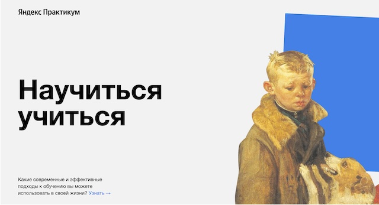

# Проект лендинговой страницы сайта "Научиться учиться"

## Описание проекта

Цель проекта - создание лендинговой веб-страницы, состоящей из 11 блоков, по
подготовленному брифу "Яндекс Практикум", с использованеим основных принципов верстки
`HTML` (включая анимацию и iframes), таблиц стилей `CSS`, методологии `БЭМ`, подготовка
файла описания проекта `README` на языке `markdown`, а также работа с репозиториями
`Git` и `GitHub`.

**Используемые технологии:**

**Инструменты разработчика:**

**Системные требования:**

